# Oxygen

The Production team use Oxygen to view, edit, validate, and transform XML files. Note that it is not open source, and while you can register for a free trial [**here**](https://www.oxygenxml.com/xml_editor/register.html), in order to use it long-term, a license will have to be purchased or transferred to you by eLife.

## How to setup a validation scenario (for Schematron)

1. First, ensure that you have cloned a version of the [**eLife Schematron**](https://github.com/elifesciences/eLife-JATS-schematron) to your local machine, in a suitable location, such as in your Documents folder.
2. Open any XML file in Oxygen.
3. In the toolbar, click 'Configure Validation Scenario(s)'.

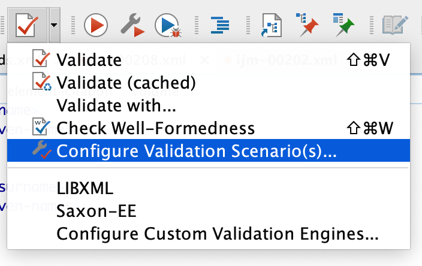

      4\. In the pop-up, click 'New'.

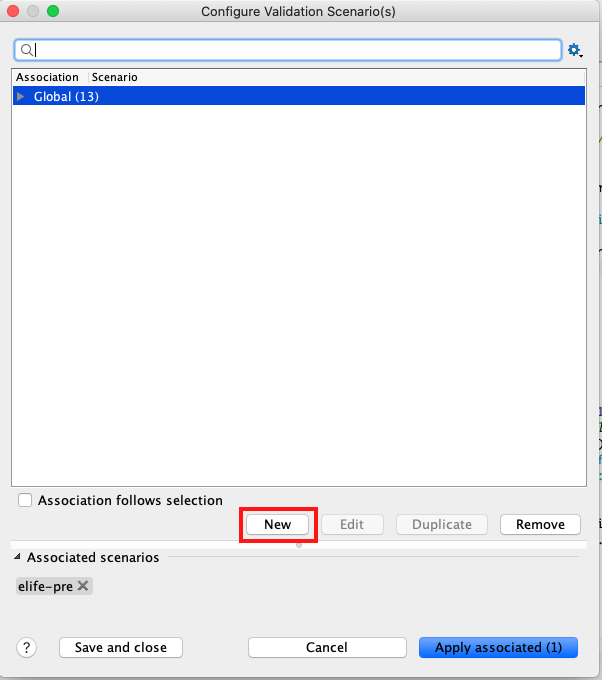

      5\. In that pop-up, rename the scenario to something appropriate, for example if setting up a scenario for the pre-author version of the eLife Schematron, you could name it 'eLife Pre'.

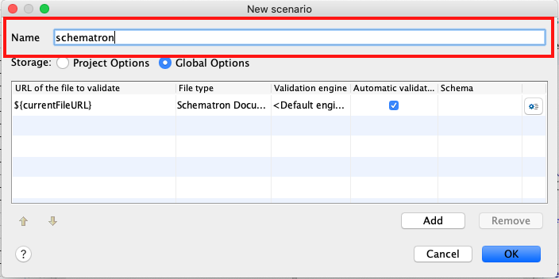

       6\. For storage, tick 'Global options':

.png>)

      7\. Click the cog symbol in the furthest right column:

 (1).png>)

        8\. In the specify schema pop-up, select 'Use custom schema':

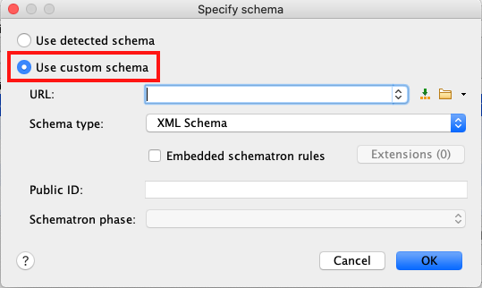

        9\. Click the folder symbol next to the URL field, navigate to and select the Schematron file which you would like to set up the validation scenario for (either `pre-JATS-schematron.sch` or `final-JATS-schematron.sch`; you will find these files in the folder where you cloned the GitHub repo):

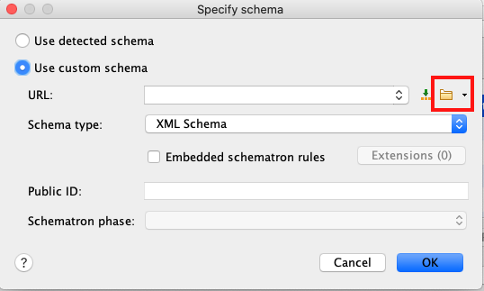

        10\. The Schema type should also automatically update to 'Schematron' upon selection of a Schematron file, but if it doesn't, then this will need to be changed:

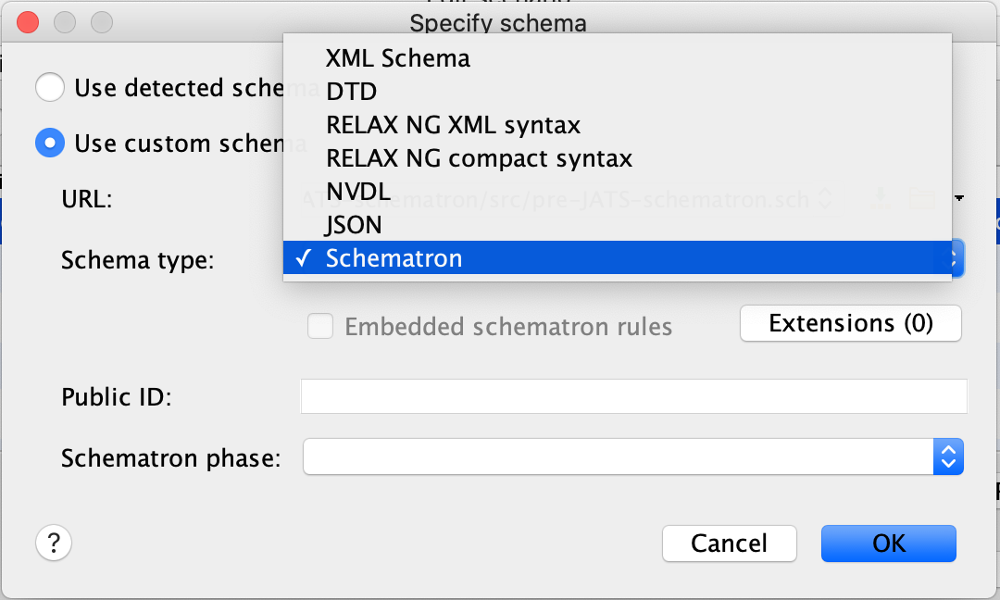

        11\. Click OK. Click OK in the next pop-up, and then in the last pop-up click 'Save and close' (in the bottom left):

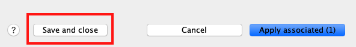

You have now created a validation scenario. You can then run this scenario on numerous different XML files by opening the 'Configure Validation Scenario(s)' pop-up, ticking the scenario with the name which you just created, and then clicking 'Apply associated (1)'.

### Validation output example

Schematron validation in Oxygen will display like this:

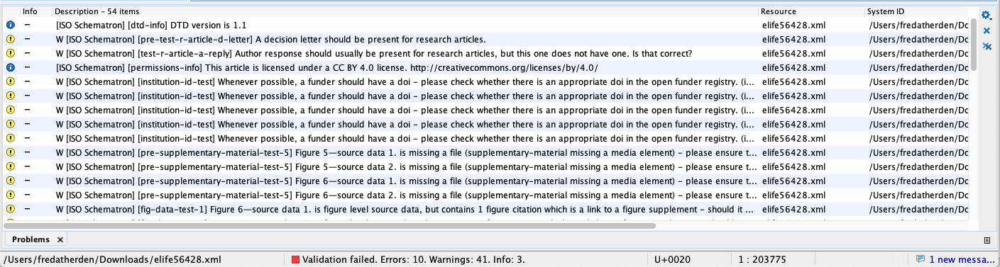

Note that you can organise the messages by clicking the column headings:

.png>)

For example clicking the left most column heading (which usually has no text), above the blue, yellow and red icons organises the messages by type (info, warning and error respectively).

If you cannot see the full message, you can hover over it, or right-click and click 'Show message' to see it in full.

Some messages have accompanying explanations/instructions in this GitBook. They will display in oXygen with a book symbol in the Info column:

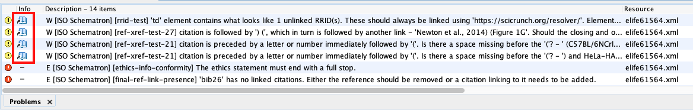

Clicking the book symbol will open a link to the relevant section of the relevant GitBook page for that message in your default browser.

## How to set up the Crossref transformation scenario

1. Download the zip below, unzip it (inside should be a file called `crossref.xsl`) and place it somewhere on your local machine such as your desktop.



2\. Open any XML file in Oxygen.

3\. In Oxygen's top toolbar, click 'Configure Transformation Scenarios' (or press cmd + shift + t).

4\. Click 'New' -> XML transformation with XSLT.

5\. Rename the scenario something appropriate, like Crossref.

6\. Click the folder for XSL URL, and navigate to where your local version of `crossref.xsl` was placed.

7\. Ensure that one of the following is selected for the 'Transformer':

* Saxon-PE (the most preferable option if available)
* Saxon-HE
* Saxon-EE

8\. Click 'Output'.

9\. Click 'Save as', and in the field next to it paste the following: `elife-crossref-${xpath_eval(substring-after(doc('${rootMapURL}')//publisher_item/item_number[@item_number_type="article_number"]/text(),'e'))}-${xpath_eval(format-dateTime(current-dateTime() + xs:dayTimeDuration('PT30M'), '[Y0001][M01][D01][H01][m01][s01]'))}.xml`

10\. Click 'OK', and then click 'Save and close'.

## Editing a saved transformation scenario

If you need to edit a transformation scenario then this can be done by clicking 'Configure Transformation Scenarios', clicking the scenario in question, and then clicking 'Edit'.

### Working example

You have just deleted or moved the XSLT file that a scenario relied upon and therefore it no longer works.

In order to fix this do the following:

* Click 'Configure Transformation Scenarios', click the scenario in question, and then click 'Edit'.
* In the pop-up click on the folder next to the XSL URL field. Navigate to the updated file location and click Open, then click OK.
* Click save and close to save the edited Scenario.


A very similar process can be followed in the same case but for a validation scenario.


## Setting up the latin terms XQuery in oXygen

1. Download the file below place it somewhere on your local machine such as your documents folder.



2\. Open any XML file in Oxygen.

3\. In Oxygen's top toolbar, click 'Configure Transformation Scenarios' (or press cmd + shift + t).

4\. Click 'New' -> XML transformation with XQUERY.

5\. Rename the scenario something appropriate, like Latin terms.

.png>)

6\. Click the folder for XQuery URL, and navigate to where your local version of `latin-terms.xq` was placed.

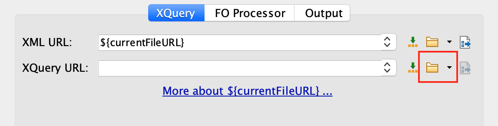

7\. Select `Saxon-PE XQuery ...` for the 'Transformer':

.png>)

8\. Click 'Parameters':

.png>)

9\. In the Configure parameters pop-up, click 'new':

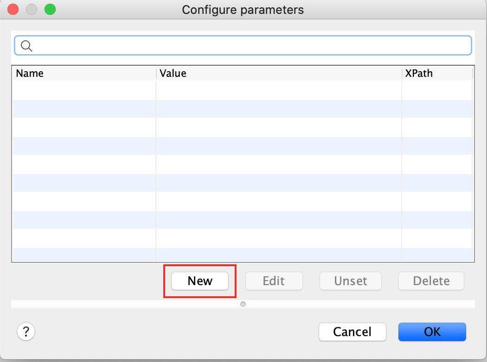

10\. In the 'Add parameter' pop-up, in the 'Name' field add 'xml' (all lowercase):

11\. In the 'Value' field, enter the following:

`doc('${currentFileURL}')`

12\. Tick 'Evaluate as XPath':

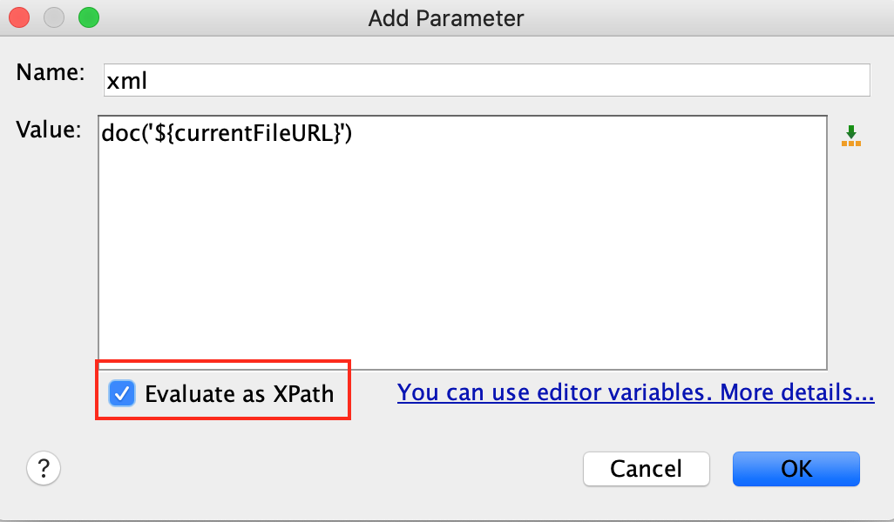

13\. Click 'OK'. Click 'OK' again. Click 'OK' again. Click 'Save and close'.

You can now run the latin terms XQuery as you would an XSLT.

When run, you'll get an output which looks something like this:

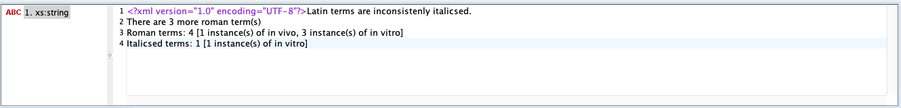

## Useful keyboard shortcuts and tips

### (Mac) Keyboard shortcuts

* Use cmd + shift + y to wrap text into one screen (no horizontal scrolling is then needed), this adds no whitespace.
* Use cmd + shift + w to check if an XML file is well formed.
* Use cmd + shift + v to run any associated validation scenarios.
* Use cmd + shift + t to run any associated transformation scenarios.
* Use cmd + shift + p to format and indent (note that this also includes adding whitespace and should not be done prior to validation since many of the tests rely on the whitespace being correct).


Do not format and indent if the XML needs to be uploaded anywhere, this should _only_ be used for ease of reading the XML, as and when needed.


### Miscellaneous Tips

* Do not format and indent before running validation.
* Use 'Outline' to navigate the XML tree without having to 'prettify' the XML.
* XPaths can be run in the top left.
* The find and replace tool in Oxygen is really useful. You can refine searches using XPath(s), and use search case specifically or using Regular expressions.
