# Striking images

## **What is a striking image?** 

To maximise the impact upon publication, it is beneficial if an eye-catching image highlighting the research is available to promote the article.

At eLife, when an acceptance letter is sent out, we encourage authors to submit a promotional image that we call a 'striking image'. This can be emailed to the Production team directly and/or uploaded during their submission to eJP.

It is important to know that when authors send these images to us, they may refer to them in other ways. Other journals use promotional images for such things as: 

* **Cover images** - These are used as front cover images on the article's journal issue. 
* **Graphical abstracts** - A single, visual summative which explains the key findings of the study. Authors can use a relevant figure for this from the article or create a new image.  At eLife we do not typically include or host these on our website**.** Please see below for an example. 

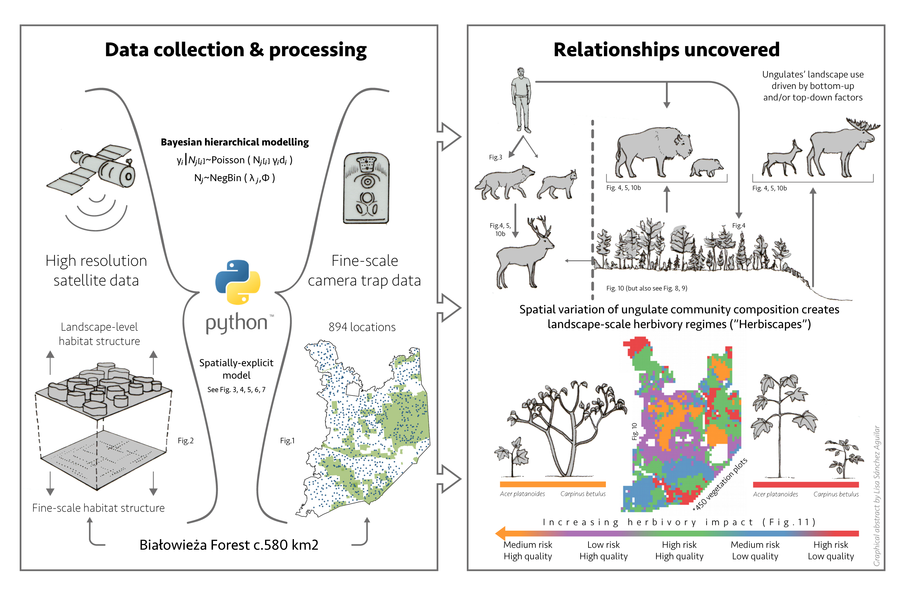

## **Uses for striking images**

Striking images can be used in the following ways 

* a homepage image \(see [**here**](https://elifesciences.org/archive/2020) for the homepage archive\)
* to accompany the Digest in the eLife Digest channel \(note: this cannot accompany the Digest on the journal article HTML view or in the PDF\) \(see [**here**](https://elifesciences.org/digests) for the Digest channel\)
* to promote the article via social media channels \(see [**here**](https://twitter.com/eLife/status/1278358999386259457) for an example on Twitter\)

The authors are also free to use these images for their own social media and press releases and do not need to ask permission for this because they fall under the CC-BY license along with the rest of the content.

Some authors can be confused about the intended use of their striking image. As mentioned in the previous section, other journals might include these as covers. Occasionally, eLife authors contact us expecting to see their striking image on the personalised poster which they can download from their 'The full version of your eLife article is now available' email they receive upon publication. If you should need to reply to an author about this, you can find further information about the Hiver template 'Cover image response' [**here**](interacting-with-authors.md#hiver-templates). 

## **Requirements** 

These images should preferably be in colour, in a landscape format, and be at least 1800 x 900 pixels in size. Photographs, microscopy images, and illustrations work best. PNG, TIFF, or JPEG formats are preferred, and we must be able to use the image under the terms of the CC-BY license. 

We assume the images provided are licensed under CC-BY and do not check this information. If there is a caption or attribution information provided with the image this should be added to the 'metacontent' when uploading via Kriya \(see [**below**](striking-images-1.md#uploading-via-kriya)\) or in the legend field when uploading via eJP \(see [**below**](striking-images-1.md#uploading-via-ejp)\).

## Examples of suitable striking images

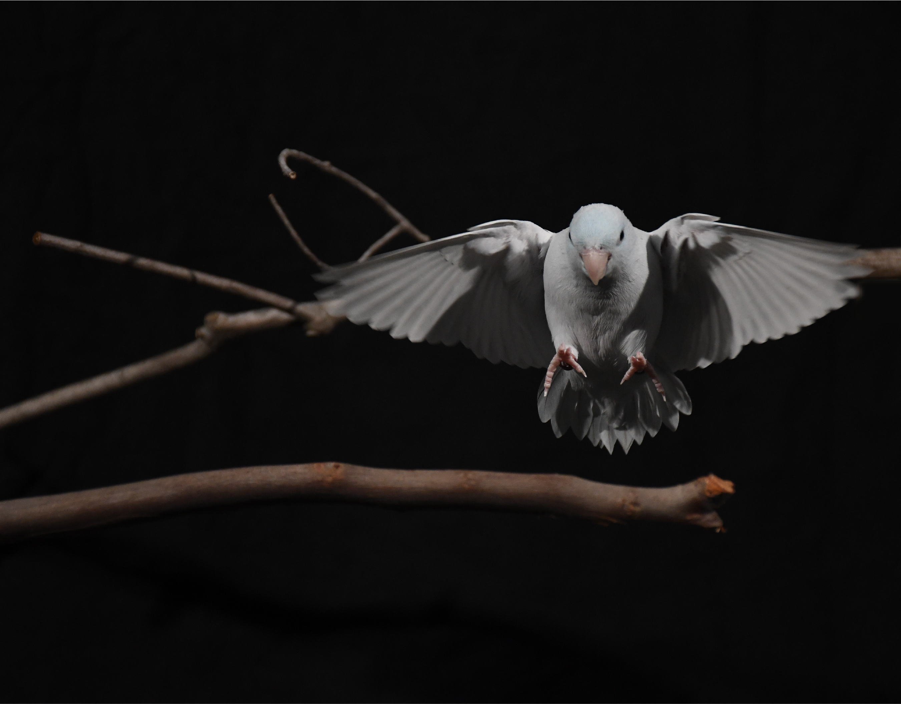

 

## Uploading a striking image 

Authors can email Production with a striking image as indicated in the acceptance email from Editorial and will have been provided with the guidance shown below.

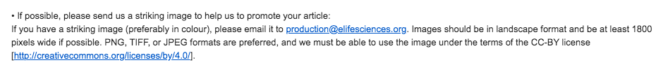

The authors may only include the title of the article within the email or email title, without including the manuscript tracking number. In these cases, you can often find the article in eJP using the article title or email address of the author. If you are unable to determine which article the striking image relates to, the author will need to be asked what their manuscript tracking number is, so we can ensure the striking image is associated with the correct article.

The striking images are held in the elife-striking-images AWS bucket and you can upload the images in three ways: straight to the bucket, via eJP, and the Kriya dashboard. 

If the article has been exported from eJP and is in Kriya, upload the image via the Kriya dashboard. If the article is still within eJP and not yet exported, upload it to eJP. It is important **not** to load it to eJP if the article is already in the production system because the systems do not transfer further information with each other after export has occurred.The most efficient way to do this is to search the Production inbox for the XML notification, which informs production an article has been exported from eJP.

### Uploading via Kriya 

To upload a striking image to an article, download the image provided by the author, go to the article in the Kriya dashboard and click on 'Striking image'. 

When the uploader appears, select the file and then click on 'Update'. Do not add text to the 'metacontent' field unless the authors have provided a caption or attribution information, in which case enter the provided text here. 

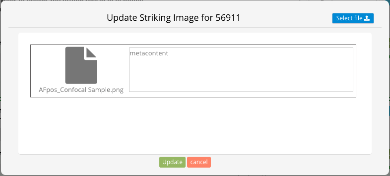

It is worth noting that you are unable to select multiple images to upload through the 'Select file' icon. If an author has provided more than one image, upload them successively within the **same** session. Successive upload sessions overwrite what was previously uploaded. Authors who provide more than one image are giving us more choice of images to use. 

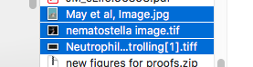

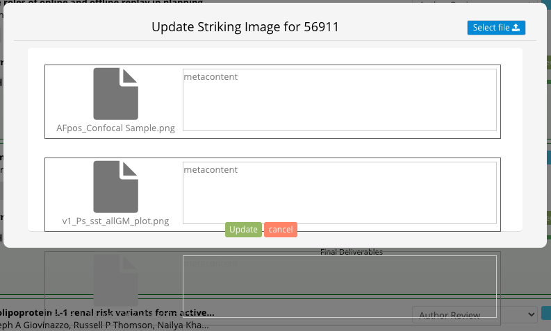

The screenshot above shows multiple images selected within the same session. You can see that the images start showing off the box, but this is normal. You can still edit the metacontent field if needed. 

Due to a dashboard bug, after clicking on 'Update' the uploader will not automatically close. You will need to refresh the page. Double-check the article in the dashboard to make sure the 'Striking image' button is now green. Alternatively, you can bring up the striking images AWS bucket at the same time and after you have clicked update, you can refresh the bucket to ensure this has been uploaded. 

### Uploading via the striking images AWS bucket 

The AWS \(Amazon Web Services\) bucket is a remote file storage system. If you require access to this, please speak to a member of Production. You can use cloud storage browsers such as Cyberduck or Transit to view the bucket. 

Once you have access to this, you will start at the overview of all of the main folders the AWS bucket stores. You need to search for the 'elife-striking-images' folder, click this to open it. 

You will now see all of the striking images that have been uploaded, organised in their own separate folders. For ease, you can search if an article has a striking image using the 'Search' bar and typing in the MS number. 

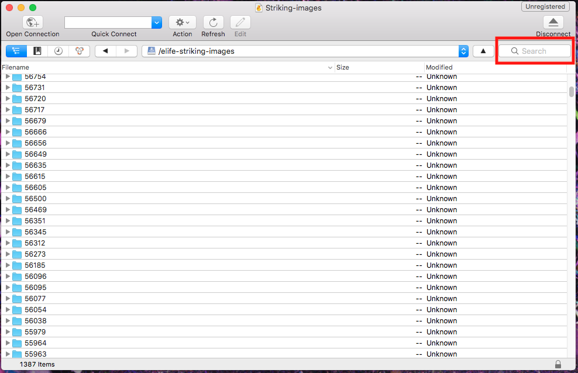

There are times when you may need to access the striking images bucket directly, for example, if an image is too large to upload via Kriya, Kriya is down, or a striking image has already been uploaded. 

#### Creating a new folder 

It is typically easier, if you can, to use the Kriya dashboard as it sets up the initial folder and creates the .txt files automatically. In certain situations, mentioned above, you may need to manually create a folder for an article's striking image. 

To do this, you need to go to the 'elife-striking-images' bucket and create a new folder. You can either do this through the 'File' menu at the top left hand corner of your screen or right click to bring up this option on the 'elife-striking-images' bucket overview. Click 'New Folder...'.

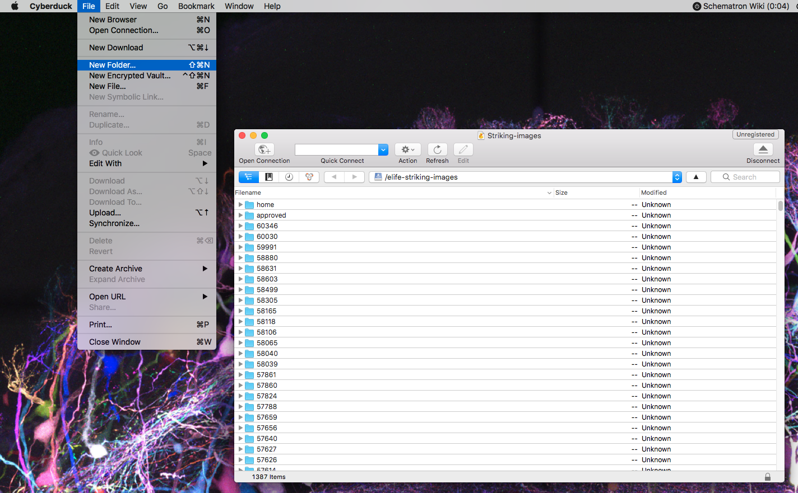

Now type or paste the MS number into the folder name field and click 'Create'. 

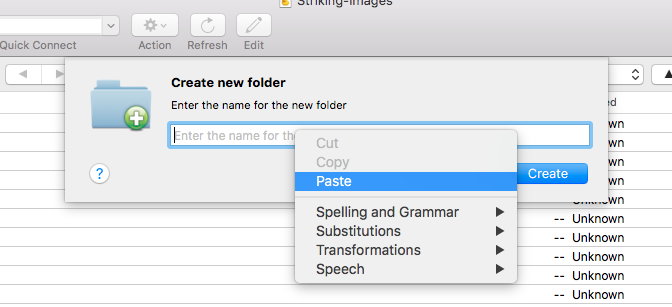

This will now appear in the folder list and should be highlighted for your convenience. 

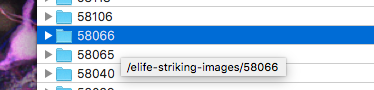

You should open your newly created folder and you will be presented with a blank folder. Drag your image into the folder and it will start to upload. 

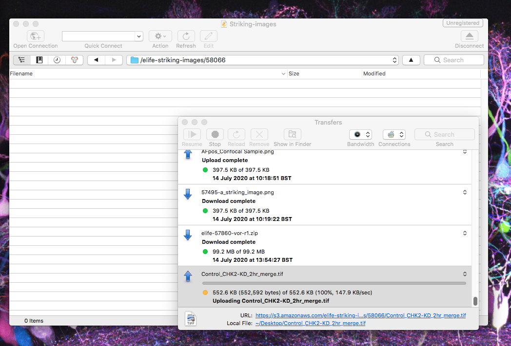

Once it has finished uploading, you will need to right click on the file to rename it. Make sure the striking image is titled following this format - '58066-a\_striking\_image', '58066-b\_striking\_image', etc. File names are created with the -a suffix and each additional image will work its way along the alphabet. If the authors have provided a title, caption, or attribution information, enter this into a .txt file and upload this into the bucket with the same title as the image \(i.e. '58066-a\_striking\_image'\). If they have not provided this information, you do not need to include a .txt file. 

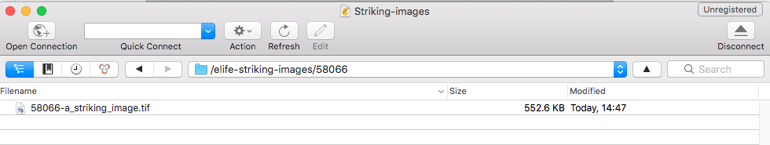

#### Existing striking images

If an article already has a striking image and it has already been exported to Kriya, but the authors would like to add another, the image will need to be uploaded straight to the striking image bucket. To do this, open the 'elife-striking-images' bucket in Cyberduck \(or similar program\) and search for the MS number. 

Open this folder and drag and drop the new striking image in to upload it. Make sure the striking image is titled appropriately - e.g. '56754-b\_striking\_image' if there is already a '56754-a\_striking\_image'. If the authors have provided a title, caption, or attribution information, enter this into a .txt file and save with the same title \(i.e. '56754-b\_striking\_image'\). If they have not provided this information, you do not need to include a .txt file. 

If you have multiple images to upload with captions, you may prefer to upload these all together through the Kriya dashboard. To do this, you should download any existing images and .txt files \(if these contain any captions\) from the bucket and upload these along with the new images as shown in the previous section.  

### **Uploading via eJP** 

To upload the image to eJP, search eJP using the MS number.

Ensure this article has not already been exported from eJP to Kriya. The most efficient way to do this is to search the Production inbox for the XML notification, which informs production an article has been exported from eJP \(see [**here**](managing-the-production-inbox.md#xml-notification-emails)\).

However, if you are in eJP look at 'More Manuscript Info and Tools' on the right-hand side of the page. If the 'Export to Exeter' option is not displaying but instead says 'Resend/Export to Exeter Premedia' this means the article has already been exported.   

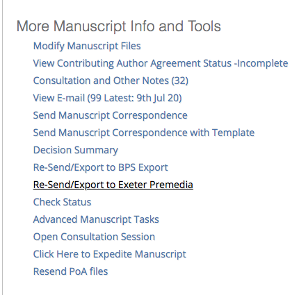

Once you are sure that the article has not yet been exported, click 'Modify Manuscript Files' under the 'More Manuscript Info and Tools' menu. 

This will bring up the file list as shown below.  

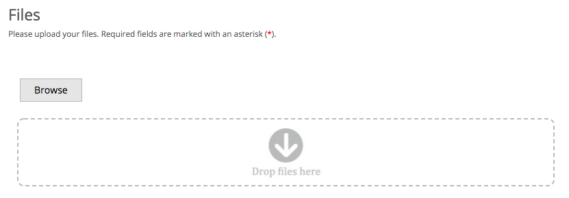

You can drag and drop the striking image into this field and it will automatically be added to the bottom of the list. You should scroll down and click 'Upload files'.

Once this has been uploaded, you will be presented with a drop down menu to select the file type. Please select 'Potential Striking Image'. This will then bring up a title and legend box that can be filled in. The authors may not provide a title so you can leave this as 'Potential Striking Image' but if any caption or image credit has been included in the email, ensure this is added to the legend and click save. 

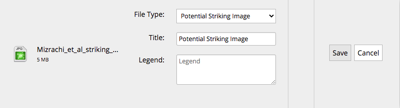

Once you have done this, click 'Save and Exit'

## Striking images from the Features team

The Features team work with authors to write Digests and often, during this correspondence the authors will send them striking images. Features will then forward on these emails to us. 

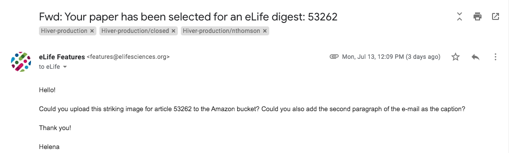

These images and any captions highlighted to us will need to be uploaded to the AWS bucket. Often the articles are already in Kriya so you can search the MS number on the dashboard and upload as usual. Occasionally, the author will have already sent us the striking image or uploaded it via eJP so you should download what is in the AWS bucket so that you can check the images and captions have been uploaded correctly. 

## Changelog

After Exeter have fed back on the page and it has been updated, any further changes to the page should be listed in order from oldest to most recent.

**dd/mm/yyyy**

_Changes_

**dd/mm/yyyy**

_Changes_

