# Homepage images

## What are homepage images?

On eLife's [**homepage**](https://elifesciences.org/), we feature three [**striking images**](./) on an image carousel. Each image will stay on the carousel for three weeks, which offers the chance of promoting the article during this time. Only VOR articles are selected for the homepage, not PoA articles.

## What makes a great homepage image?

When looking through the possible striking images, it is important to keep in mind that the image will be in landscape orientation with white text overlaying the image. The image should have a strong visual impact and ideally not contain more than one panel. As mentioned in the striking image [**guidance**](./#requirements), there should be no graphs, text, or summary figures. The best choices are colour photographs, microscopy images and illustrations. It is also good practise to look at the other images on the carousel and try to vary the theme of the images if you can. 

The requirements for Journal CMS \(the website used to change the homepage image\) are as follows: 

* Maximum of 32MB, 
* Image size larger than 1800x900 pixels
* Accepted formats are png, jpg, and jpeg.

### Examples

Below are some of the images that have featured on the homepage. 

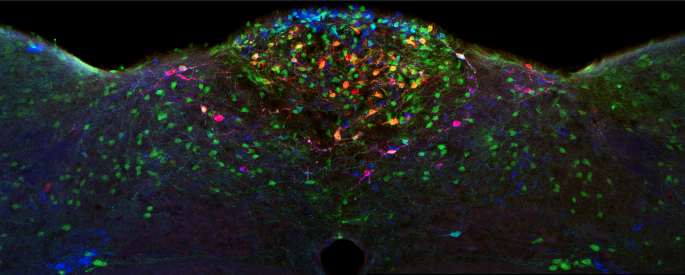

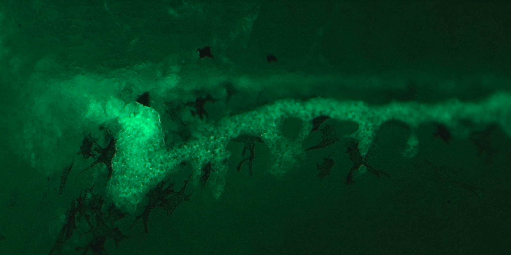

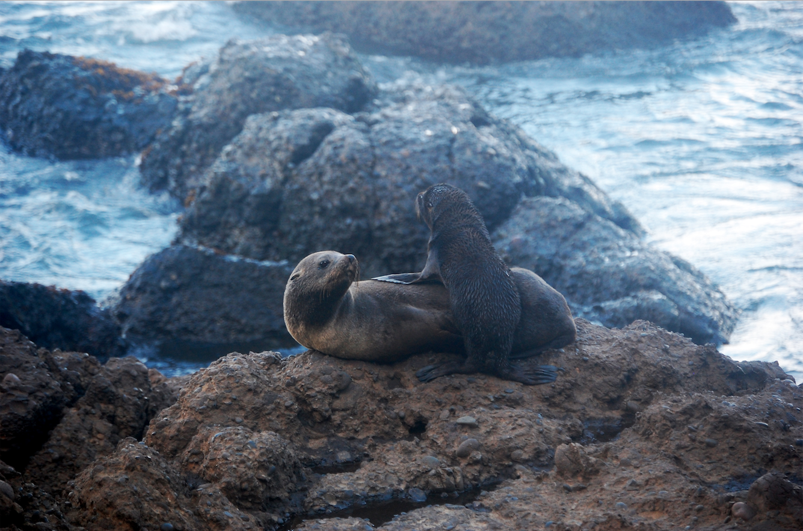

## Selecting a homepage image

The new homepage image is selected from the striking images of VOR articles that have been published from Wednesday, of the previous week, to the following Tuesday. The words are requested on the Monday morning so, if you were to pick a VOR article that has not yet been published, it is best to only use press papers that are already scheduled for that Tuesday. 

You can use the Production team action sheet to look for articles that have been scheduled, and/or use the eLife's website to find VOR articles that have been published in the previous week. As you bring up each article, you will need to search the striking image bucket to see if it has a suitable image. Once you have found an image, you will then need to send this to Peter as outlined below. On the rare occasion that you do not find a suitable image, you should email Peter to let him know. Then either send an image later in the day when more articles have been published or at the very latest, Tuesday morning. 

If you have found an image but it is not quite right, i.e slightly too small, you should able to adjust this in a photo editing programme such as Photoshop. However, you should not make any significant changes to the photo. 

## Homepage image wording

The homepage image is selected by a nominated member of the Production team on a Monday morning and this image will be emailed to Peter \(on the Features team\) to provide the wording which overlays the image. This text is a short description of the article which you can see on the carousel at the top of this page.

To ensure this is not forgotten, a reminder email is sent to the Production inbox. 

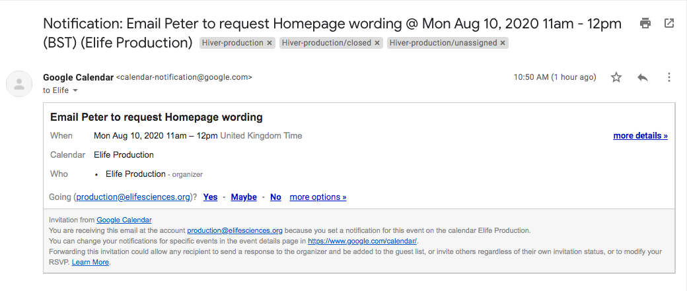

There will be a homepage image email thread for the month, typically in the format 'Homepages for August'. If it is a new month, a new email thread will need to be made. Ensure each request email contains both the manuscript number and the striking image you have selected. 

If the image selected is a large size, it is advisable to use a screenshot of the image to save on space in the inbox. 

Peter will reply with the wording and this sentence should be transferred over to the Production team action sheet, including any italics used. 

## Changing the homepage image

The homepage image is changed on Tuesday afternoon, an email reminder will be sent to the Production inbox. 

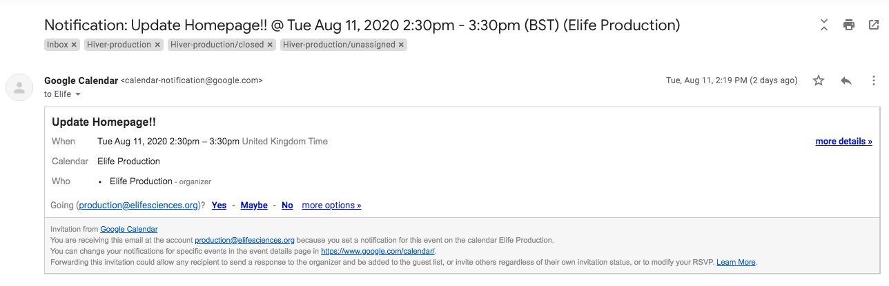

To do this, follow the steps below. 

* Go to [**https://prod--journal-cms.elifesciences.org/**](https://prod--journal-cms.elifesciences.org/)\*\*\*\*
* Log in. If you do not have login credentials, please speak to a member of the Production team. 
* Hover over the 'Structure' tab at the top of the page and click on 'Entityqueues'.

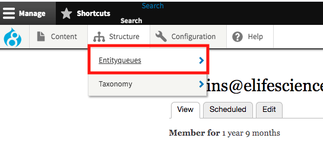

* In the queue 'Covers preview', click on 'Edit items'. 

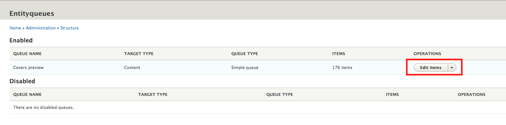

* Scroll to the bottom of the page and click on 'Add new cover'. 

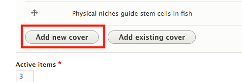

* In the 'Title' field, enter the words that Peter has provided. **Note:** There should be no full stop at the end of the sentence. 

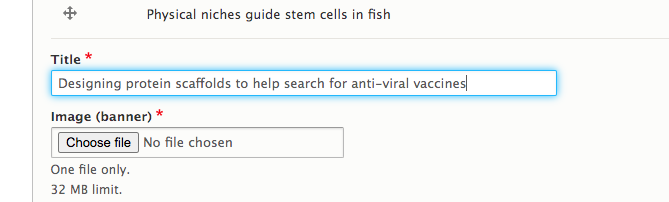

* Now 'Choose file' under the 'Image \(banner\) field. It may help to already have the chosen image on your desktop. After you have selected/opened your image, the system will alert you if there are any problems with the image. Typically, this is due to size or file type. **Reminder:** the images must be a maximum of 32MB, larger than 1800x900 pixels, and in either png jpg jpeg format. Leave the field 'Alternative text' blank.

* If there is an image attribution, this should be entered in the field below. 

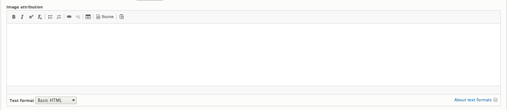

* Enter the manuscript number into ‘Related content item’ field and select it from drop-down menu. It will enter it into the field with another number in brackets next to it. Ensure you **do not** use an unpublished article.

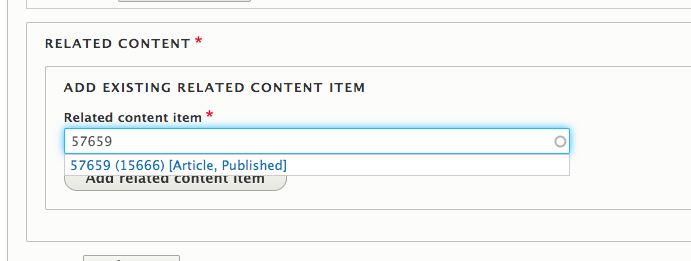

* Click on 'Add related content item' beneath the 'Related content item' field. 

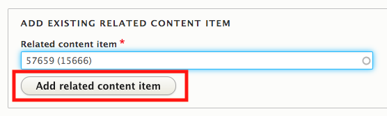

* Click 'Create cover' which will put this new cover at the bottom of the items list. 

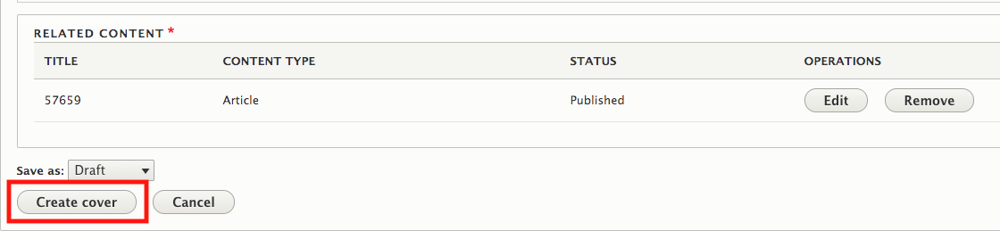

* Move the cover to the top of the items list using the arrow to the left of the row.

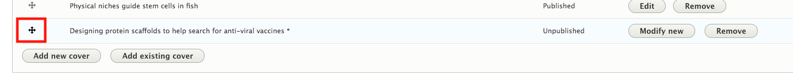

* Now the cover is at the top of the page, you need to scroll down to the bottom of the page again and tick 'Publish items', then click 'Save'. 

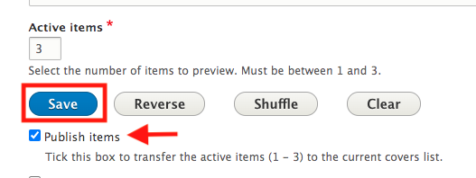

* This process is now done. To ensure the homepage has updated correctly, check the eLife homepage after at least 15 minutes. 

## Changelog

* 
### dd/mm/yyyy

#### Changes

* 

