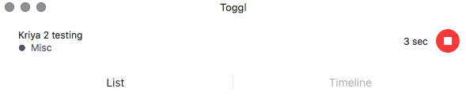

# Toggl


For the changelog, click [**here**](toggl.md#changelog).


## What is Toggl?

[**Toggl track**](https://toggl.com/) is a time-tracking application that the eLife production team uses to monitor how much time is spent on different tasks. This information will be used to monitor the effect of changes to workflows, to track the distribution of work compared to article volumes, to monitor the team's availability to work on projects outside the day-to-day tasks, and so on.

The Toggl interface works via self-reporting, with the user required to start and stop the timer. The user can add a manual description of the task, assign it to a preset ‘project’ and add one or more preset tags.

## Projects and tags

A preset list of projects is maintained to account for standard production tasks. These can be edited within the Toggl browser interface at [**https://track.toggl.com/projects/**](https://track.toggl.com/projects/). When beginning or editing a task in the desktop application, the project can be set from the following control:

Tags can be appended to the task to provide further details about what is being done. Multiple tags are permitted per task, but most of the preset tags are intended for use with specific projects.

The following is a full list of projects and the associated tags currently in use by the production team.

<table>
  <thead>
    <tr>
      <th style="text-align:left">Project</th>
      <th style="text-align:left">Associated tags</th>
    </tr>
  </thead>
  <tbody>
    <tr>
      <td style="text-align:left">&lt;b&gt;&lt;/b&gt;<a href="toggl.md#continuum-checks"><b>Continuum checks</b></a>&lt;b&gt;&lt;/b&gt;</td>
      <td
      style="text-align:left">New version</td>
    </tr>
    <tr>
      <td style="text-align:left">&lt;b&gt;&lt;/b&gt;<a href="toggl.md#emails"><b>Emails</b></a>&lt;b&gt;&lt;/b&gt;</td>
      <td
      style="text-align:left">
        
Emails: author details

        
Emails: datasets

        
Emails: figures

        
Emails: math

        
Emails: morning

        
Emails: permissions

        
Emails: press

        
Emails: proof access

        
Emails: proof edits

        
Emails: proof return delay

        
Emails: pub date query

        
Emails: software

        
Emails: striking images

        
Emails: typesetting

        
New version

        </td>
    </tr>
    <tr>
      <td style="text-align:left">&lt;b&gt;&lt;/b&gt;<a href="toggl.md#gitbook"><b>GitBook</b></a>&lt;b&gt;&lt;/b&gt;</td>
      <td
      style="text-align:left">
        
Reviewing

        
Updating

        
Writing

        </td>
    </tr>
    <tr>
      <td style="text-align:left">&lt;b&gt;&lt;/b&gt;<a href="toggl.md#gitlab"><b>GitLab</b></a>&lt;b&gt;&lt;/b&gt;</td>
      <td
      style="text-align:left"></td>
    </tr>
    <tr>
      <td style="text-align:left">&lt;b&gt;&lt;/b&gt;<a href="toggl.md#home-page"><b>Homepage</b></a>&lt;b&gt;&lt;/b&gt;</td>
      <td
      style="text-align:left"></td>
    </tr>
    <tr>
      <td style="text-align:left">&lt;b&gt;&lt;/b&gt;<a href="toggl.md#kriya-dashboard"><b>Kriya - dashboard</b></a>&lt;b&gt;&lt;/b&gt;</td>
      <td
      style="text-align:left"></td>
    </tr>
    <tr>
      <td style="text-align:left">&lt;b&gt;&lt;/b&gt;<a href="toggl.md#libero-editor"><b>Libero Editor</b></a>&lt;b&gt;&lt;/b&gt;</td>
      <td
      style="text-align:left"></td>
    </tr>
    <tr>
      <td style="text-align:left">&lt;b&gt;&lt;/b&gt;<a href="toggl.md#meetings"><b>Meetings</b></a>&lt;b&gt;&lt;/b&gt;</td>
      <td
      style="text-align:left"></td>
    </tr>
    <tr>
      <td style="text-align:left">&lt;b&gt;&lt;/b&gt;<a href="toggl.md#misc"><b>Misc</b></a>&lt;b&gt;&lt;/b&gt;</td>
      <td
      style="text-align:left"></td>
    </tr>
    <tr>
      <td style="text-align:left">&lt;b&gt;&lt;/b&gt;<a href="toggl.md#poa"><b>PoA</b></a>&lt;b&gt;&lt;/b&gt;</td>
      <td
      style="text-align:left">New version</td>
    </tr>
    <tr>
      <td style="text-align:left">&lt;b&gt;&lt;/b&gt;<a href="toggl.md#pub-check"><b>Pub check</b></a>&lt;b&gt;&lt;/b&gt;</td>
      <td
      style="text-align:left"></td>
    </tr>
    <tr>
      <td style="text-align:left">&lt;b&gt;&lt;/b&gt;<a href="toggl.md#pub-review"><b>Pub review</b></a>&lt;b&gt;&lt;/b&gt;</td>
      <td
      style="text-align:left">New version</td>
    </tr>
    <tr>
      <td style="text-align:left">&lt;b&gt;&lt;/b&gt;<a href="toggl.md#schematron"><b>Schematron</b></a>&lt;b&gt;&lt;/b&gt;</td>
      <td
      style="text-align:left"></td>
    </tr>
    <tr>
      <td style="text-align:left">&lt;b&gt;&lt;/b&gt;<a href="toggl.md#slack"><b>Slack</b></a>&lt;b&gt;&lt;/b&gt;</td>
      <td
      style="text-align:left">New version</td>
    </tr>
    <tr>
      <td style="text-align:left">&lt;b&gt;&lt;/b&gt;<a href="toggl.md#training"><b>Training</b></a>&lt;b&gt;&lt;/b&gt;</td>
      <td
      style="text-align:left"></td>
    </tr>
  </tbody>
</table>

### Continuum Checks

**Recommended description**:

* Article number

**Associated tags**:

* New version - _where this is carried out for a new version, silent correction or official correction to an article_

This is used to track time spent checking articles on the journal preview site. The description should be the five-digit article number. Where the check is being carried out on a new or corrected version of an article, the **New version** tag should be applied.

### **Emails** 

**Recommended description**:

* Article number for correspondence on a specific article
* 'No digest email' for time spent checking features update about articles set to no-digest
* Otherwise, describe the task

**Associated tags**:

* Emails: author details - _use for questions about or edits to author information_
* Emails: datasets - _use for correspondence about datasets_
* Emails: figures - _use for emails providing replacement images or question related to figure display_
* Emails: math - _use for issues with equations in articles_
* Emails: morning - _apply to email tasks carried out at the start of the day related to clearing notification emails out of the inbox_
* Emails: permissions - _use for emails related to permissions for images and other assets reproduced from previously published works_
* Emails: press - _use for emails regarding press releases_
* Emails: proof access - _use for authors experiencing login/access problems with the proofing system_
* Emails: proof edits - _use for edit requests sent via email_
* Emails: proof return delay - _use for requests to extend the proofing deadline_
* Emails: pub date query - _use for questions about when articles will be published_
* Emails: software - _use for questions regarding software_
* Emails: striking images - _use for emails providing striking images and uploading the images to the system_
* Emails: typesetting - _use for queries from the content processors and correspondence with the authors to resolve issues at the pre-editing stage_
* New version - _use for emails that trigger or are related to an official correction, new version or silent correction of an article_

This project is used for time spent working on emails and managing the production inbox. There are a number of tags and shared descriptions that apply to this task. However, general assignment and filing of emails can be recorded without any description.

When an email task is related to a specific article, the number should be included as the description. If it relates to the regular notifications from the Features team regarding articles that will not receive a digest, 'No digest email' should be used as the description.

Please note that the time recorded under 'email' is all the time required to complete whatever tasks are prompted by that email, that is, reading, investigation, system updates, sending queries to third parties and responding to the email should all be included in the one time recording. Correspondingly, if an email is consulted as part of another task \(e.g. [**Pub review**](toggl.md#pub-review)\), the time taken should be recorded as part of that task, rather than 'Emails'.

### GitBook

**Recommended description**:

* Name of the page being worked on

**Associated tags**:

* Writing - _use for the initial draft and revisions of the page_
* Reviewing - _use for checking over drafts written by other members of the team_
* Updating - _use for making updates to the page after initial publication_

This is used to record time spent working on the production GitBook. The description should be the name of the page being worked on. There are three dedicated tags for this task, denoting three stages of the production of documentation.

### GitLab

**Recommended description**:

* The number of the ticket being worked on

This is used to track time spent on GitLab tickets opened with the production vendor, usually related to bugs and improvements in the proofing system.

### Homepage

**Recommended description**:

* Choosing homepage image
* Changing homepage image

This is for recording time spent on updating the eLife homepage image. It covers both choosing the homepage from available options \(in which case the description entered should be 'Choosing homepage image'\) and changing the image on the homepage \(in which case, the description should be 'Changing homepage image'\).

### Kriya - dashboard

**Recommended description**:

* refreshing
* assigning articles

To help monitor the performance of the Kriya proofing system, it is helpful to track the time taken to refresh the page and to assign articles. However, it's accepted that other tasks may be completed while the page is reloading, so these should take priority in terms of tracking. We accept that the data for this description will therefore be incomplete and will revist this later as the system is updated.

### Libero Editor

This is used to track time spent working on the Libero Editor project - that is, assisting with design, development and testing of a new article proofing system.

### Meetings

**Recommended description**:

* The name/purpose of the meeting

This is used to track time spent in meetings \(which can add up quite a lot on some days!\).

### Misc

**Recommended description**:

* Article number \(if applicable\)
* Otherwise, the description of the task

This category is used for any task not covered by the other projects. If a miscellaneous task is used often enough, it may be considered for being promoted to a project label in Toggl.

### PoA

**Recommended description**:

* Article number

The PoA project covers time spent working on Publish on Accept articles. This can include updating article publication dates, replacing PDFs or assisting the Editorial Office team in other matters related to the PoA process. The number for the article being worked on should be added to the description.

### **Pub check**

**Recommended description**:

* Article number

This task tracks time spent on the 'Publisher Check' stage in the proofing system.  This should be tracked from when the user begins looking at the article \(either by opening the article or checking the notes on it\) to when they stop working on it, by either logging out of the proof or signing it off to the next stage.

### **Pub review**

**Recommended description**:

* Article number

**Associated tags**:

* New version - _where this is carried out for a new version, silent correction or official correction to an article_

This task tracks time spent on the 'Publisher Review' stage in the proofing system.  This should be tracked from when the user begins looking at the article \(either by opening the article or checking the notes/emails on it\) to when they stop working on it, by either logging out of the proof or signing it off to the next stage. Where the check is being carried out on a new or corrected version of an article, the **New version** tag should be applied.

### Slack

**Recommended description**:

* Article number \(if applicable\)

This tracks time spent communicating on slack, either in relation to a specific article \(e.g. answering questions from the content processors, discussing with the editorial team\) or general communication \(such as assisting another member of the team\).

### **Training**

Time spent training other members of the team should be recorded using the Training project.

## Changelog

* Updated 2021-03-24 - text and labels updated for full accounting of current processes

