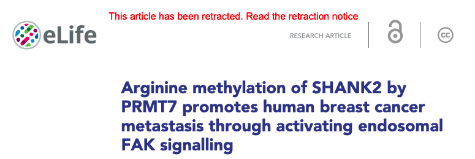

# Versioning

Despite everyone's best efforts, some articles will require correcting/updating because of errors. eLife aims to make this process as open and transparent as possible, preserving links to earlier versions of articles for readers and making clear what has changed and why. 

## Types of versions

* New versions \(also known as V2\)
  * Issued if the error is visible, but does not affect the scientific content of the research, for example, typos in names, incorrect funding or affiliation information, minor typos, minor figure edits \(without changing the data itself\) etc. An annotation is added to the article on the eLife website to alert readers to the change. If there are errors in PoAs, new versions of these can also be issued before the VoR if appropriate \(see more here\). 

* Silent corrections
  * Issued if the correction does not affect scientific content or result in a visible change in the article, for example, if the error is in the XML. No annotations are added on the website - the article is silently updated. 
* Official corrections
  * Issued if an error affects or impacts upon the scientific content of the article, for example, major corrections to figures \(e.g. incorrect/duplicated western blot panels, changes to p values or any other data changes\) or text edits affecting some scientific conclusions. The corrected article has a red banner heading on the eLife website to link readers to the correction notice. 

* Retractions
  * Issued if an error calls into question the scientific conclusions of the article. The retracted article has a red banner heading on the eLife website to link readers to the retraction notice, as well as a heading on the PDFs to indicate the article has since been retracted.


Except for new versions, post-publication changes are only applied for VoRs.


It can be tricky to figure out whether an error affects the scientific meaning/conclusions of the article. If there is any doubt, this should be discussed with the Production team in the first instance, and the Editorial team as well if required.

## Processing new versions

If an author has indicated their article needs correcting and you have determined a new version is appropriate, let them know we will issue this to correct the error as soon as possible. The article then needs to be resupplied from the published archive on Kriya. If some time has passed since the article was first published, it's a good idea to first ask the authors to check over the article again to see if anything else needs to be updated, to prevent the need for issuing multiple new versions. Once this has been done, the article can be resupplied. Add the article number to the [**Production actions**](https://docs.google.com/document/d/1gWMKdmcl4i7EC_bHvrbpBcUKoXuMQ4WfrVDJ1HxQ0cc/edit) sheet, indicating it is a V2 and what the V2 is for:

The article will appear at the publisher review stage and you can then assign it to yourself and make the required changes, sending it to Exeter if needed. Once the change has been made, send the article to Continuum and check and publish as usual. After doing so, update the Production actions sheet with the correct tag:

Once the updated article is live, add an annotation using hypothesis:

Highlight the most recent 'Version of Record updated' text and click on 'Annotate'.

The first time you do this, you will need to sign in to ORCID. Then, copy and paste the following text and edit accordingly:

> A new version of this article was issued to \[insert reason here\]
>
> \*added by eLife staff\*

Click on 'Post to eLife' and the annotation will be saved.

Once this is done, email the authors to let them know their article has been updated and cross the article off the actions sheet.

## Processing official corrections

An official correction is required when an author wishes to make changes to the scientific content of their work after publication. This is the chief difference between this kind of correction and a new version: the changes affect the scientific content and potentially the conclusions presented in the article, therefore readers must be informed that the article has changed.

Official corrections consist of a new version of the article and a related ‘correction notice’ giving a description of the edits made and, where appropriate, the reasons why. These two items are published simultaneously.

When an author requests a change to their article that constitutes an edit to the scientific content, Editorial will need to be informed. It will usually be clear from the author’s message to what extent the changes affect the content of the article but if there is any uncertainty, correspond with Editorial to make the decision. The editors who handled the article will need to be informed of the required correction. Editorial will then work with the authors and editors to draft and approve the text for the correction notice. This will then be emailed to the Production team for processing. 

**Starting off**

* Add the number of the article to be corrected to the Production actions sheet under your name with the prefix OC 
* Download the correction notice to your desktop along with any figures to be updated
* If there are figures to update, download these from the email and also download the published versions from the article on the eLife website. 
  * Label them like this: Figure1\_original, Figure1\_new, Figure2\_original, Figure2\_new. 

**Open EJP**

* Click ‘Submit manuscript’ on EJP homepage
* Chose ‘Correction’ from options list
* Click ‘Confirm and proceed’

**Files**

* Drag and drop files. Click ‘Upload files’. Change file type \(correction notice = ‘Article file’\)
* Correct file order: article file comes first, then figure files in numerical order with the corrected version of each one coming before the original \(change file type to ‘Figure’, figure number = ‘Revised Figure 3’, for example\)
* Click ‘Next’

**Title** 

* Write ‘Correction:’ in front of original article title \(ignore ‘\[...\] characters over’ if this appears\)
* Click ‘Next’

**Author information**

Open the original article in EJP

→ ‘Title’ and have the original EJP article open side-by-side with the new notice

Add author names in the order they appear on the eLife websitein original order → ‘Find user’ → ‘Save/Hide’

Tick the box for the corresponding author

Cross check author info

Answer ‘No’ to group authorship

→ ‘Next’

**Major subject areas**

Copy across msa \(use cmd to select 2+\) and research organisms \(author keywords aren’t necessary\)

→ ‘Next’

**Licensing**

→ ‘Not completed’

→ ‘Creative Commons Attribution 4.0 International Public License \(CC BY 4.0\)’

→ ‘Display electronic form’

Scroll to bottom of agreement 

Write corresponding author’s name in box

Tick confirmation statement 

→ ‘I agree’

→ ‘Next’

Review manuscript files 

Check files 

Check figure file order; corrected figures come before original, article file at the top

→ ‘Next’

Approving the manuscript

\[Characters exceeded in title and a red box showing: ignore! → ‘Next’\] 

→ ‘Approve manuscript’ and copy full article tracking number \[e.g. 06-04-2018-CR-eLife-37316\]

Linking the notice and original article 

Go to the original article in EJP

→ ‘Advance manuscript tasks’ on right-hand list

→ ‘Link manuscripts’ in far left-hand column 

Enter article tracking number for the notice \[e.g. 06-04-2018-CR-eLife-37316\] into the ‘Manuscript’ box

→ ‘Find second manuscript’

Write ‘Correction notice’ into ‘Link note’ box

→ ‘Link’ 

E.g. ‘Manuscripts 17-03-2017-RA-eLife-26952R1 and 06-04-2018-CR-eLife-37316 are linked.’ will show at the top of the homepage

→ ‘Find manuscript’ and search correction notice number \[e.g. 37316\]

Check ‘Related manuscripts’ shows original article is linked

Exporting the notice

Go to the correction notice \[e.g. 37316\]

→ ‘Auto accept and move to production’ on right-hand column

→ ‘Prepare XML data’ 

→ ‘Transfer’

\[This will send the notice to Kriya and will be exported in the next export cycle\]

## Processing etractions

## Link to downstream deliverables

