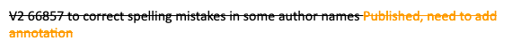

# Versioning

Despite everyone's best efforts, some articles will require correcting/updating because of errors. eLife aims to make this process as open and transparent as possible, preserving links to earlier versions of articles for readers and making clear what has changed and why. Some updates are not delivered to all downstream services - to find out more, see [**here**](article-details/relationships/downstream-deliveries.md#where-we-send-elife-content).

## Types of versions


All post-publication changes to content are processed by the Production team. For changes to Feature content \(including Digests\), the Features team make the decision about what type of update to issue, usually preferring silent corrections over V2s.


* New versions \(also known as V2s\)
  * Issued if the error is in the content \(not XML formatting\), but does not affect the scientific content of the research, for example, typos in names, incorrect funding or affiliation information, minor figure edits \(without changing the data itself\) etc.

* Silent corrections
  * Issued for formatting errors is in the XML. No annotations are added on the website - the new version replaces the version present on the site and no change history is available to the viewer. 
* Official corrections
  * Issued if an error impacts the scientific content of the article, for example, major corrections to figures \(e.g. incorrect/duplicated western blot panels, changes to p values or any other data changes\) or text edits affecting some scientific conclusions. The corrected article has a red banner heading on the eLife website to link readers to the correction notice. 

* Retractions
  * Issued if an error calls into question the scientific conclusions of the article. The retracted article has a red banner heading on the eLife website to link readers to the retraction notice, as well as a heading on the PDFs to indicate the article has since been retracted.

When an author gets in touch to ask for a change to their article, it can sometimes be difficult to figure out whether an error affects the scientific meaning/conclusions of the article \(and whether a V2 or silent correction is more appropriate\). If there is any doubt, this should be discussed with the Production team in the first instance, and the Editorial team as well if required. 

For minor errors such as typos that do not affect scientific content, authors should be encouraged to leave annotations on the eLife website instead of issuing a new version. Authors can do this by highlighting the appropriate text, selecting 'Annotate' and then typing and posting the replacement text. 

The Editorial team will usually decide if an article requires a correction/retraction. See more [**here**](versioning.md#processing-official-corrections-and-retractions). 


New versions, silent corrections and retractions can be issued for both VoRs and PoAs. Only VoRs tend to have official corrections. 


## Processing new versions

### PoA

Once the Publish on Accept version of an article is live, it is counted as a publication and can be updated in the same way as VoRs. However, as the VoR will eventually replace the PoA version, authors should be asked to make any updates at the proofing stage and V2s should be avoided for PoAs where possible. The exceptions are: 

* Typos in author names
* Incorrect affiliations \(not simply inconsistencies between the PDF and website display of affiliations\) 
* Any issues affecting readability of the article e.g. rendering issues in the PDF

Editorial Office handle versioning for PoAs - if one is required, they should be emailed with the details of the change and asked to issue a V2. The authors should also be told that their article will be updated as soon as possible. 

### VoR

If an author has indicated their VoR needs correcting and you have determined a new version is appropriate, let them know we will issue this as soon as possible. The article then needs to be resupplied from the published archive on Kriya. If some time has passed since the article was first published, it's a good idea to first ask the authors to check over the article again to see if anything else needs to be updated, to prevent the need for issuing multiple new versions. Once the authors have replied about this, the article can be resupplied. Add the article number to the [**Production actions**](https://docs.google.com/document/d/1gWMKdmcl4i7EC_bHvrbpBcUKoXuMQ4WfrVDJ1HxQ0cc/edit) sheet, indicating it is a V2 and what the V2 is for:

To resupply an article, search for the article number in Kriya 2 and then click on it. It should be in the archive: 

Click on the pen icon to enter the article, and then select 'Approve'. If any schematron messages come up, click 'Proceed to sign-off' and then on 'send to publisher \(Resupply\)'.

The article will then appear at the publisher review stage and you can assign it to yourself and make the required changes, sending it to Exeter if needed. Make sure to validate the XML against the Schematron as usual. If the article is older, there may be some error messages, as the Schematron may have been updated since the article was published. Most can be ignored, but double-check whether any should be actioned. For example, the old Major Subject Area \(MSA\), 'Human Biology and Medicine' was updated to 'Medicine' in 2020. Therefore, when updating these articles, the old MSA 'Human Biology and Medicine' needs to be changed to 'Medicine'.


When updates were made to MSAs, these were batch-updated, bypassing Kriya. Some articles also had additional MSAs added at this point. Therefore when making changes to these articles, you will need to check the current MSAs of the article on the eLife website and ensure these are all present in Kriya.


If there are no Schematron errors, send the article to Continuum and check and publish as usual. However if there are Schematron error messages that can't or don't need to be resolved, Exeter will need to turn off the validator so the article can be sent to Continuum - ask them to do this in Slack, noting in the Production channel that this has been done. Once the article is on Continuum, ask Exeter to turn the validator back on \(and let the Production channel know when this has been done\). 

Once the new version has been published, update the Production actions sheet with the correct tag:

Once the updated article is live, add an annotation using Hypothesis \(the website annotation feature used by eLife\):

Ensure you are logged in to ORCID so you can annotate the article. Highlight the most recent 'Version of Record updated' text and click on 'Annotate'.

Then, copy and paste the following text and edit accordingly:

> A new version of this article was issued to \[insert reason here\]
>
> \*added by eLife staff\*

Click on 'Post to eLife' and the annotation will be saved.

Once this is done, email the authors to let them know their article has been updated and cross the article off the actions sheet.

## Processing silent corrections

Silent corrections can be issued if the update does not change the content. These are processed in a similar manner to [**new versions**](versioning.md#processing-new-versions) - except there is no Continuum check step. Instead, after checking the relevant changes have been made, the article is sent straight to the website and published automatically via the silent-corrections AWS bucket. Silent corrections replace the current version on the website by overwriting it.

No annotations should be left to indicate the change because the reader cannot see an old version to verify against. Silent corrections should only be used for XML issues and not content changes \(with the exception of Features content\).

For Digest corrections, once the article has been resupplied from the archive, the Features team need to upload the correct text to the digest bucket before it can be signed off to Silent Correction.

## Processing official corrections and retractions 

An official correction is required when an author wishes to make changes to the scientific content of their work after publication and this needs to be clear to all readers wherever they may access the content. Official correction notices are published and linked to the research content on other sites such as PMC, Scopus and Web of Science, as well as the eLife website and this is a historic scholarly publication process that all publishers adhere to \(publishing correction notices\).

Official corrections consist of a new version of the article and a related ‘correction notice’ giving a description of the edits made and, where appropriate, the reasons why. These two items are published simultaneously.

When an author requests a change to their article that constitutes an edit to the scientific content, Editorial will need to be informed. It will usually be clear from the author’s message to what extent the changes affect the content of the article but if there is any uncertainty, correspond with Editorial to make the decision. The editors who handled the article will need to be informed of the required correction. Editorial will then work with the authors and editors to draft and approve the text for the correction notice. This will then be emailed to the Production team for processing. Note, this is a subjective decision sometimes.

Retractions are issued when the findings of an article are found to be incorrect. eLife publishes retraction notices alongside articles that have been retracted, but the content of the articles remain on the website for transparency. The Editorial team will contact Production when a retraction is required and provide the retraction notice. 

### Issuing a correction or retraction notice in eJP

The steps to issue a correction or retraction notice in eJP are the same - the only difference is retraction notices never have figures. 

**Starting off**

* Add the number of the article to the Production actions sheet under your name with the prefix OC 
* Download the correction notice to your desktop along with any figures to be updated
* If there are figures to update, download these from the email and also download the current published versions from the article on the eLife website. 
  * Label them clearly e.g.: Figure1\_original, Figure1\_new, Figure2\_original, Figure2\_new. 

**Open EJP**

* Click ‘Submit manuscript’ on the EJP homepage
* Chose ‘Correction’ or 'Retraction' from the options list
* Click ‘Confirm and proceed’

**Files**

* Drag and drop files. Click ‘Upload files’. Change file type \(correction notice = ‘Article file’\)
* Correct file order: article file comes first, then figure files in numerical order with the corrected version of each one coming before the original \(change file type to ‘Figure’, figure number = ‘Revised Figure 3’, for example\)
* Click ‘Next’

**Title** 

* Write ‘Correction:’ or 'Retraction:' in front of original article title \(ignore ‘\[...\] characters over’ if this appears\)
* Click ‘Next’

**Author information**

* Open the original article in EJP
* Click ‘Title’ and have the original EJP article open side-by-side with the new notice
* Add author names in the order they appear on the eLife websitein original order → ‘Find user’ → ‘Save/Hide’ 
* Tick the box for the corresponding author
* Cross check author info
* Answer ‘No’ to group authorship
* → ‘Next’

**Major subject areas**

* Copy across MSA \(use cmd to select 2+\) and research organisms \(author keywords aren’t necessary\)
* → ‘Next’

**Licensing**

* → ‘Not completed’
* → ‘Creative Commons Attribution 4.0 International Public License \(CC BY 4.0\)’
* → ‘Display electronic form’
* Scroll to bottom of agreement 
* Write corresponding author’s name in box
* Tick confirmation statement 
* → ‘I agree’
* → ‘Next’

**Review manuscript files** 

* Check files 
* Check figure file order; corrected figures come before original, article file at the top
* → ‘Next’

**Approving the manuscript**

* \[Characters exceeded in title and a red box showing: ignore! → ‘Next’\] 
* → ‘Approve manuscript’ and copy full article tracking number \[e.g. 06-04-2018-CR-eLife-37316\]

**Linking the notice and original article** 

* Go to the original article in EJP
* → ‘Advance manuscript tasks’ on right-hand list
* → ‘Link manuscripts’ in far left-hand column 
* Enter article tracking number for the notice \[e.g. 06-04-2018-CR-eLife-37316\] into the ‘Manuscript’ box
* → ‘Find second manuscript’
* Write ‘Correction notice’ into ‘Link note’ box
* → ‘Link’ 
* E.g. ‘Manuscripts 17-03-2017-RA-eLife-26952R1 and 06-04-2018-CR-eLife-37316 are linked.’ will show at the top of the homepage
* → ‘Find manuscript’ and search correction notice number \[e.g. 37316\]
* Check ‘Related manuscripts’ shows original article is linked

**Exporting the notice**

* Go to the correction notice \[e.g. 37316\]
* → ‘Auto accept and move to production’ on right-hand column
* → ‘Prepare XML data’ 
* → ‘Transfer’

The notice will then be sent to Kriya in the next export cycle.

### Processing corrections/retractions in Kriya

Once the notice has been exported, the article to be corrected or retracted can be resupplied from the archive. 

For corrections: 

* Replace the figures and make any text edits according to the notice. If there are extensive edits, the article may need to be sent back to Exeter to correct. 
* Once the required changes have been made to the article, check everything over again, and then update the pub-date of the **correction notice** \(not the research article itself\) to today's date. 
* Send the correction notice and corrected article to Continuum for final checks, and once these are done, publish the article and the notice simultaneously via the batch publishing option on the Continuum dashboard. 

For retractions:

* Send the article to Exeter to add the retraction header to the article and figures PDFs. **No other changes should be made to the research article.**
* Once the retraction header has been added, check everything over again, and then update the pub-date of the **retraction notice** \(not the research article itself\) to today's date. 
* Send the retraction notice to Continuum for final checks, and once these are done, send the research article for a silent correction and publish the retraction notice. The two pieces should be published as simultaneously as possible. 

Make sure to validate the XML against the Schematron as usual. If the article is older, there may be some error messages, as the Schematron may have been updated since the article was published. Most can be ignored, but double-check whether any should be actioned. For example, the old MSA, 'Human Biology and Medicine' was updated to 'Medicine' in 2020. Any updates to articles with the MSA 'Human Biology and Medicine' would therefore need to include a change to the MSA as well.


When MSAs were changed, many articles had additional MSAs added via silent correciton. updating MSAs, check the currently published article on the eLife website and make sure they match before sending the article to Continuum. 


If there are no Schematron errors, send the article to Continuum and check and publish as usual. However if there are Schematron error messages that can't or don't need to be resolved, Exeter will need to turn off the validator so the article can be sent to Continuum - ask them to do this in Slack, noting in the Production channel that this has been done. Once the article is on Continuum, ask Exeter to turn the validator back on \(and let the Production channel know when this has been done\). 

Once the required changes have been made to the article, check everything over again, and then update the pub-date of the correction or retraction notice to today's date. Both the notice and the article can then be sent to Continuum for final checks. 

* Open the correction or retraction notice article as a pub review and check over it
* Resupply the article to be retracted and ask Exeter to add the retraction header to article and figures PDFs
* Once this is back from Exeter, check it looks OK then update the pub-date of the retraction notice and send it to Continuum 
* Finally, send the retracted article as a silent correction.


To prevent retracted articles being redelivered to PMC, the retraction notice and corresponding article must be published on the same day.



No annotations are required for official corrections and retractions - the corresponding notice outlines the changes that were made. 


## Correcting older articles

Updates to content that was produced by TNQ \(eLife’s previous typesetter\) will need to be handled slightly differently. 

* Download the required article package from the publishing archive, \(AWS bucket ‘elife-publishing-archive’\). 
* If the change only involves the XML and not the PDF, unzip the package, edit the XML accordingly and then re-zip the folder and upload it to the prod-elife-silent-corrections AWS bucket \(changing the r number if necessary\).
* If the change affects the PDF, attach the package in an email to Exeter:
  * Subject line: TNQ correction: Article number - silent correction/new version/official correction
  * Detail in the message the change that needs to be made and whether it needs to change just in the PDF or both the XML and PDF
* Exeter will then process the article and share it for approval. 
* For V2s - Exeter will deliver the article to Continuum via the elife-production-final bucket. 
* For Silent Corrections -  upload the corrected article to the prod-elife-silent-corrections bucket.

